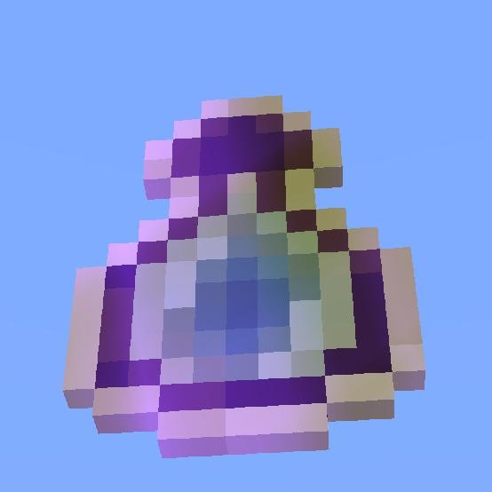

# Information

**XpMoney** finally allows you to transfer experience with money! (Using EconomyAPI) 
You can now transfer:

    - Money => EXP (EconomyAPI to Experience)
    - Exp => Money (Experience to EconomyAPI)

Via command /xpmoney for your easy profit convenience!

| Discord | License | Poggit | Release |
| :-----: | :-----: | :----: | :-----: |
||||

# Dependancies
This plugin requires: 
- **Onebone's**, **EconomyAPI**. You can download it **<a href="https://poggit.pmmp.io/p/EconomyAPI/5.7.2">here</a>**

      jojoe77777's FormAPI is built into this plugin, so no need to download the virion seperately!

# Contact
| Discord | DemeterCraft |
| :-----: | :----------: |
|Soul ✞#9999||

# Reporting Bugs
To report a bug, open an issue on the Github: 
https://github.com/Pinesolz/XpMoney
